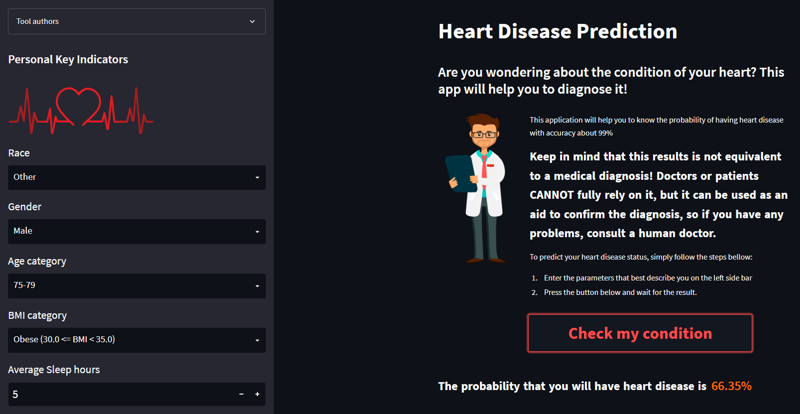

# 
Heart Disease Prediction
  
  

Heart disease is the most common cause of death in the world, and approximately 1 in 5 people die from heart disease, this project can help predicting the probability of being affected by heart disease based on a well trained Machine Learning model  
  

## General Info  
- This project was created as a Mid-Project of Samsung Innovation Campus (SIC) training.
- The application construct is located in the app.py file. This file uses dataset from `Dataset folder` and the pretrained model from `Preprocessing & Modelling` folder
- **XGBoost** has got the best accuracy with **99%** accuracy on predicting people with no HeartDisease and **91%** accuracy on predicting people with Heart Disease  
  

  
  

## Team Members  
- [Ahmed Mohsen](https://github.com/PrinceEGY)
- [Hossam Galal](https://github.com/HossamGalal68)
- [Yomna Ramdan](https://github.com/Yomna-Ramadan)  

## Technologies  
- The app is fully written in `Python 3.10.1`, the user interface was created using `streamlit 1.13.0`
- Libraries used: `pandas`, `numpy`, `seaborn`, `matplotlib`, `sklearn`, `plotly`, `imblearn`  

 

----
